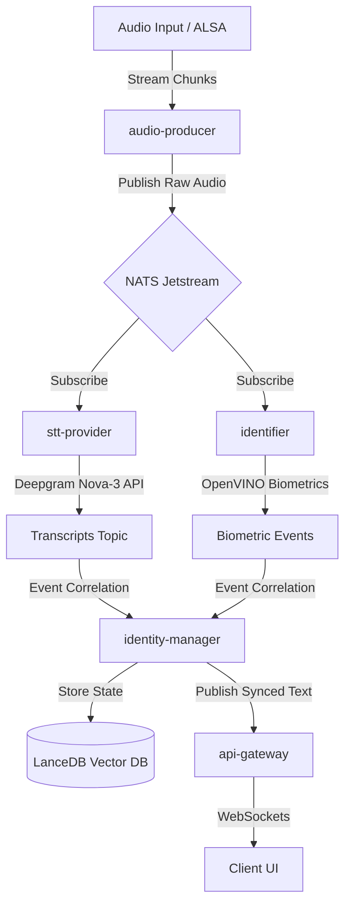

# Live STT

**Resilient, offline-first, real-time transcription appliance optimized for high-availability edge deployments.**

[](LICENSE)
[](https://github.com/TomDakan/LiveSTT)

LiveSTT is an event-driven, microservices-based speech-to-text platform designed to handle real-time streaming audio with zero data loss, even during temporary network partition events.

---

## 📖 Documentation

Full documentation is available in the `docs/` directory:

- **[Quickstart](docs/quickstart.md)**: Deploy in 10 minutes.
- **[Hardware Guide](docs/40_hardware/hbom.md)**: Industrial x86 (NUC N97) BOM.
- **[Architecture](docs/20_architecture/architecture_definition.md)**: Buffered Split-Brain design (Store-and-Forward).
- **[API Reference](docs/api.md)**: REST and WebSocket API docs.

---

## 🧬 System Architecture

The core pipeline utilizes a **Buffered Split-Brain (Store-and-Forward)** pattern, decoupling real-time ingestion from transcription and speaker identification via **NATS Jetstream** to guarantee complete tolerance against network latency spikes or transient API disconnects.



## 🌟 Features

- Buffered Split-Brain Architecture: Features custom pre-roll buffers and automated retry policies to handle cloud API disconnects gracefully.
- Deepgram Nova-3 Integration: High-accuracy, low-latency cloud speech-to-text streaming.
- Local Biometric Speaker Tagging: Integrates OpenVINO on the edge for real-time speaker identification without sending biometric voiceprints to third-party APIs.
- Monorepo Workspace Engineering: Formatted as a unified workspace managed by uv for lightning-fast environment syncs and lock-step internal versioning.
- Automated QA Safeguards: Standardized via pre-commit hooks and GitHub Actions utilizing Ruff, Basedpyright, MyPy, and security scanners (bandit and safety).

## 🖥️ Target Hardware Tiers

LiveSTT is engineered to target specific hardware configurations, adapting its resource footprint depending on whether localized biometrics (OpenVINO) are running:

| Tier | Hardware Context | Target Engine Profile | Core Use Case |
|------|------------------|-----------------------|---------------|
| Tier 1 | Industrial NUC (Intel N97) | `gpu` Docker Profile | Standalone edge appliance with Local Speaker ID |
| Tier 2 | Desktop w/ Dedicated GPU | `gpu` Docker Profile | Complete developme  nt environment with AI acceleration |
| Tier 3 | CPU-Only (Laptops / CI) | `cpu` Docker Profile | Core pipeline testing, API integrations, Web UI development |

## 🚀 Quick Start (Docker)

1. Clone & Setup:

```bash
git clone https://github.com/TomDakan/LiveSTT.git
cd LiveSTT
cp .env.example .env

# Add your DEEPGRAM_API_KEY to .env
```

1. Spin Up default services (CPU Mode):

```Bash
docker compose up
```

3.Access Services:

- Web UI: <http://localhost:8000API>
- Schema Docs: <http://localhost:8000/docs>

## 💻 Local Development Setup

 Prerequisites

- Python: 3.12+ (managed via uv)
- Package Manager: uv (for workspace management)
- Tool Manager: mise (for runtime tools)
- Task Runner: just
- Docker & Compose: To run containerized infrastructure dependencies

 Setup

  1. Clone & Initialize Runtimes:

  ``` Bash
  git clone https://github.com/TomDakan/LiveSTT.git
  cd LiveSTT
  mise install   # Automatically configures local tools (uv, just, jq)
  just install   # Syncs monorepo workspace dependencies via uv
  ```

  1. Configure Environment

  ``` Bash
  cp .env.example .env

  # Add your DEEPGRAM_API_KEY
  ```

## Running the Monorepo Architecture

For localized service development, you can spin up the supporting infrastructure and run individual microservices in separate shell windows:

```Bash
# 1. Start core data/message brokering layers
docker compose up -d nats lancedb

# 2. Run target services (in isolated terminals)

just start api-gateway
just start stt-provider
just start identity-manager
```

## Dev Shell Commands

We use just to automate development tasks. These ensure your code passes our strict automated CI/CD gating:

```Bash
just qa              # Run complete QA suite (Format, Lint, Type-Check, Tests, Security)
just format          # Format files using Ruff
just type-check      # Enforce strict types via Pyright/Mypy
just test            # Execute pytest suites
just nats-spy        # Watch raw JSON frames crossing the NATS broker
```

## 📂 Project Directory Breakdown

```
live-stt/
├── services/             # Microservices Ecosystem
│   ├── api-gateway/      # FastAPI REST and WS endpoints
│   ├── stt-provider/     # Deepgram API ingestion pipeline
│   ├── identifier/       # Local OpenVINO-driven Biometrics engine
│   └── identity-manager/ # Multi-source event-driven transcription correlator
├── src/live_stt/         # Shared libraries & utilities
├── docs/                 # Architecture Decision Records (ADRs) and HBOM specs
├── justfile              # System utility commands
└── pyproject.toml        # Shared uv monorepo configuration
```

## 🤝 Contributing

Contributions are welcome! Please review the strict workspace versioning, conventional commits guidelines, and Docker multi-architecture profiles in CONTRIBUTING.md.

## 📄 License

This project is licensed under the GNU General Public License v3.0. See the LICENSE file for the full license text.
