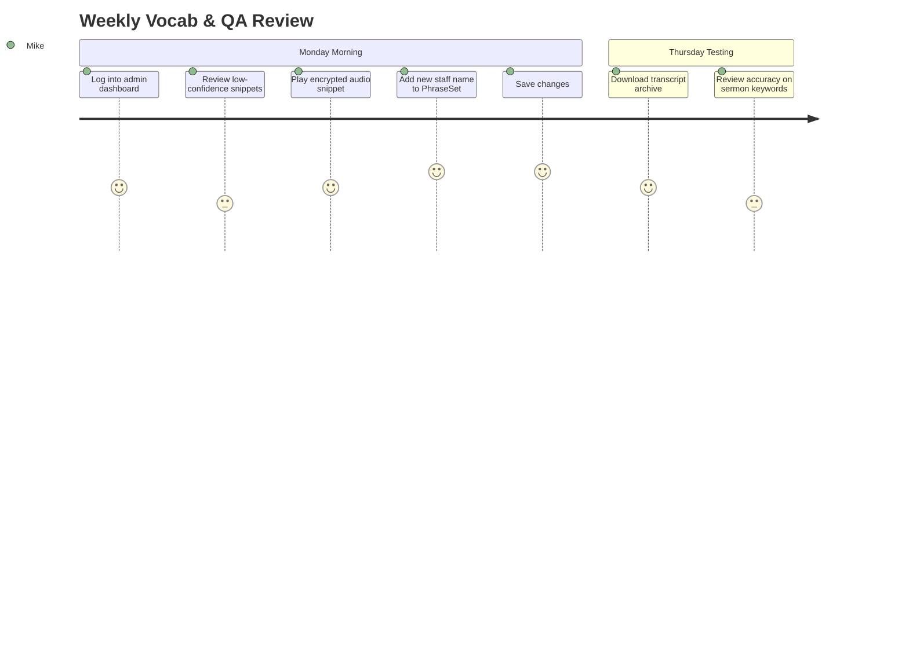
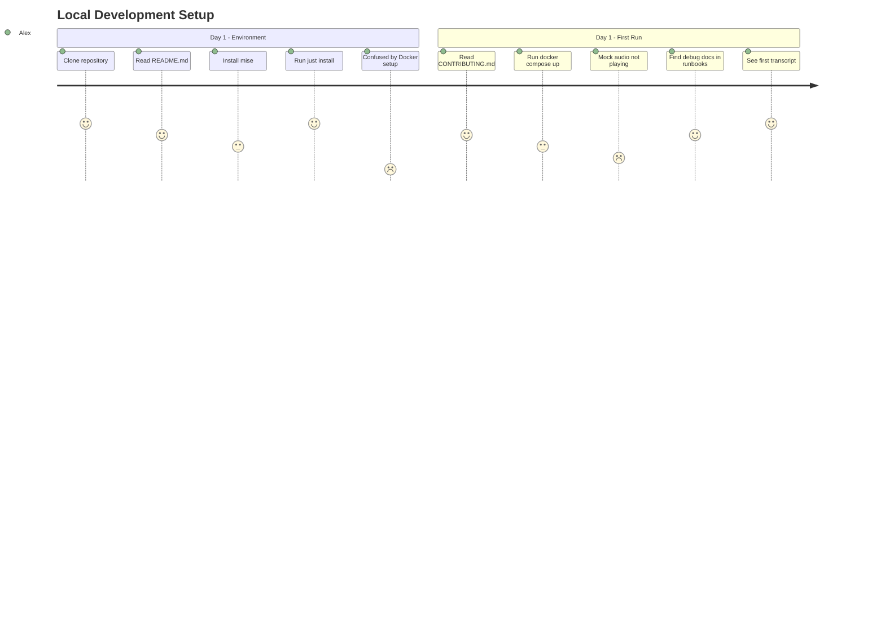
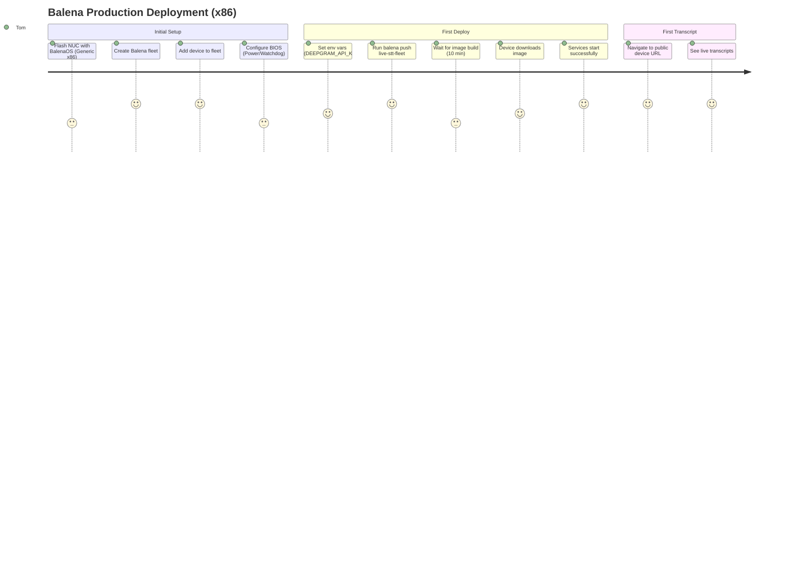

# User Journey Maps

## Overview
This document visualizes key user workflows for the Live STT system, identifying touchpoints, pain points, and opportunities.

---

## Journey 1: AV Operator - Sunday Service

### Persona
**Name**: Sarah
**Role**: Church volunteer audiovisual coordinator
**Tech Savvy**: Low (familiar with iPad, not with servers)

### Journey
```mermaid
journey
    title Sunday Service Transcription Workflow
    section Pre-Service (8:00 AM)
        Check system status: 3: Sarah
        Verify microphone connected: 5: Sarah
        Share URL with congregation: 4: Sarah
    section During Service (9:00 AM)
        Congregants view transcripts on phones: 5: Congregation
        Monitor connection status on iPad: 4: Sarah
        Notice "Reconnecting..." alert: 2: Sarah
        System recovers automatically: 5: Sarah
    section Post-Service (11:00 AM)
        No cleanup required: 5: Sarah
```

### Touchpoints
| Step | Touchpoint | Experience | Pain Points |
|------|-----------|------------|-------------|
| 1 | Open web UI | Navigate to `https://<device-url>:8000` | **Pain**: Must share URL with congregation (QR code would help) |
| 2 | Check status | Green "Live" badge visible | ✅ Clear visual feedback |
| 3 | View transcripts (congregants) | Text appears in real-time on personal devices | ✅ Responsive UI works on phones |
| 4 | Handle outage | "Reconnecting..." banner appears | ✅ System recovers without intervention |

### Opportunities
- **QR code generator**: Display QR code on admin dashboard for easy URL sharing
- **Font size controls**: User-adjustable text size in web UI
- **Dark mode**: Reduce screen glare in dimly lit church sanctuary
- **V2 - Projector mode**: Dedicated large-screen display mode (future enhancement)

---

## Journey 2: Administrator - Weekly Configuration

### Persona
**Name**: Pastor Mike
**Role**: Church senior pastor
**Tech Savvy**: Medium (comfortable with web apps)

### Journey


### Touchpoints
| Step | Touchpoint | Experience | Pain Points |
|------|-----------|------------|-------------|
| 1 | Navigate to `/admin` | Login with credentials | **Pain**: No SSO (manual password) |
| 2 | sqladmin UI | CRUD interface for tables | ✅ Familiar database admin UI |
| 3 | Review queue | List of low-confidence snippets | **Pain**: No sorting by date/confidence |
| 4 | Play snippet | In-browser audio player (encrypted stream) | ✅ Seamless playback |
| 5 | Edit PhraseSet | JSON editor for custom vocabulary | **Pain**: Raw JSON (not form-based) |

### Opportunities
- **Form-based vocab editor**: Replace JSON textarea with structured form (add/edit/delete individual phrases)
- **Confidence histogram**: Visualize snippet distribution by confidence score

---

## Journey 3: Developer - First-Time Setup

### Persona
**Name**: Alex
**Role**: Open-source contributor
**Tech Savvy**: High (Python developer, no Docker experience)

### Journey


### Touchpoints
| Step | Touchpoint | Experience | Pain Points |
|------|-----------|------------|-------------|
| 1 | README.md | Clear `mise install` instructions | ✅ Standard Python setup |
| 2 | Docker setup | Run `docker compose up` | **Pain**: Unclear which services are optional |
| 3 | Mock audio | Set `MOCK_FILE=/path/to/audio.wav` | **Pain**: No sample audio file provided |
| 4 | First transcript | Deepgram API key required | **Pain**: Must sign up for Deepgram account |
| 5 | Debugging | Check `docker compose logs stt-provider` | ✅ Docker logs accessible |

### Opportunities
- **Sample audio files**: Include `tests/fixtures/sermon_sample.wav`
- **Dev environment script**: `just dev-setup` → Pulls mock audio, sets env vars
- **Optional services docs**: Clearly document which Docker Compose profiles are needed

---

## Journey 4: System Administrator - Deployment to Industrial NUC

### Persona
**Name**: Tom
**Role**: Developer deploying to production
**Tech Savvy**: Expert

### Journey


### Touchpoints
| Step | Touchpoint | Experience | Pain Points |
|------|-----------|------------|-------------|
| 1 | Flash BalenaOS | Use Balena Etcher GUI | ✅ Standard Balena workflow |
| 2 | BIOS Config | Manual keyboard/monitor setup | **Pain**: Requires physical access |
| 3 | balena CLI | `balena push` command | ✅ Familiar to Balena users |
| 4 | Env variable management | Balena dashboard web UI | ✅ Centralized config |
| 5 | Public URL | Auto-generated HTTPS endpoint | ✅ Zero network config |

### Opportunities
- **TPM provision script**: Automate TPM key sealing in first-boot script
- **Health dashboard**: Balena dashboard plugin for service-specific metrics
- **Rollback UI**: One-click rollback to previous release

---

## Cross-Journey Insights

### Common Pain Points
1. **No sample data**: Mock audio, sample vocab files missing
2. **JSON config**: Raw JSON editing (PhraseSet) vs. form-based UI
3. **URL memorization**: No mDNS/local discovery

### Common Delights
1. **Auto-recovery**: System handles outages without manual intervention
2. **Docker simplicity**: `docker compose up` just works (Tier 3)
3. **Public URL**: BalenaOS eliminates network config headaches

---

**See Also:**
- [PRD](prd.md) - User stories and acceptance criteria
- [Quickstart](../../quickstart.md) - End-user deployment guide
- [CONTRIBUTING.md](../../CONTRIBUTING.md) - Developer setup guide
