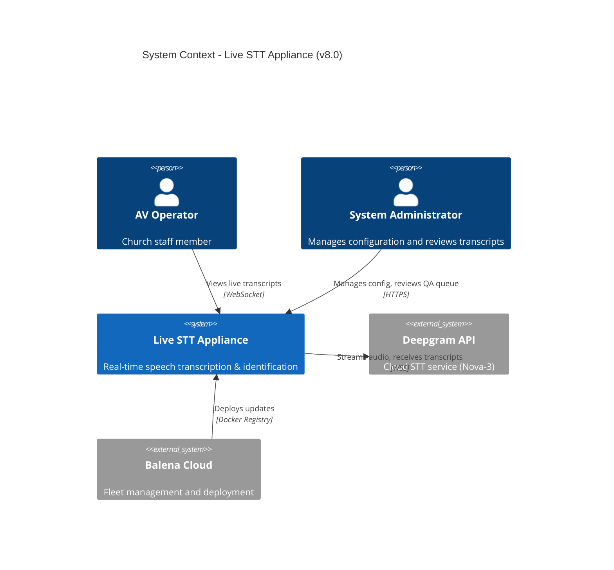
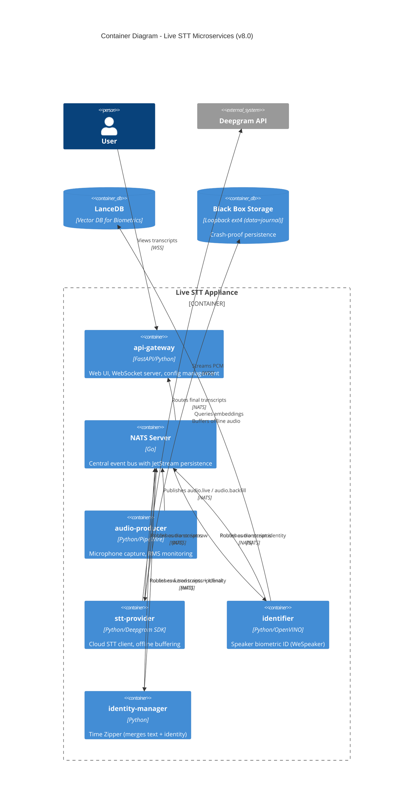
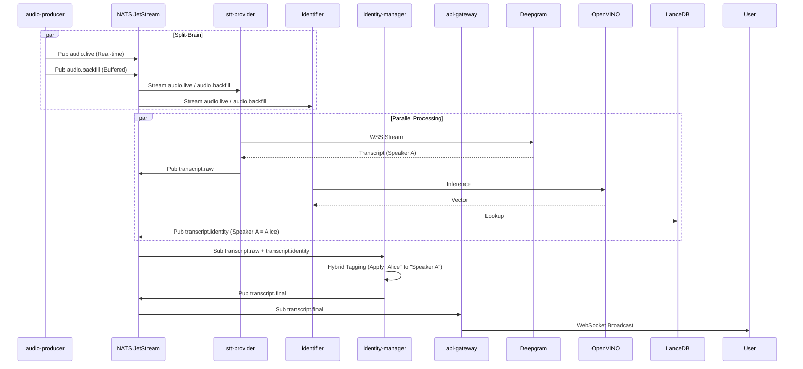

# Architecture Definition Document (ADD)

## 1. System Overview
The **Live STT** system is a high-reliability, real-time speech-to-text appliance designed for "Industrial Split-Brain" deployment on x86 hardware (ASRock Industrial NUC). It implements a dual-stream architecture where transcription is offloaded to the cloud (Deepgram Nova-3) while biometric identification runs locally on the edge (OpenVINO), synchronized via a "Time Zipper" service.

**Key Design Principles:**
- **Split-Brain Processing**: Decoupled cloud transcription (high accuracy) and edge biometrics (low latency/privacy)
- **Industrial Reliability**: Fanless x86 hardware with Power Loss Protection (PLP) and "Black Box" filesystem
- **Event-Driven**: NATS-based messaging backbone for persistence and observability

## 2. System Context (C4 Level 1)


## 3. Container Diagram (C4 Level 2)


## 4. Component List

| Service | Technology | Purpose | Resilience Strategy |
|---------|-----------|---------|---------------------|
| **NATS** | Go | Central event bus | JetStream persistence, cluster-ready |
| **audio-producer** | Python/PipeWire | Mic capture | Ring buffer, non-blocking I/O |
| **stt-provider** | Python/Deepgram | Cloud STT client | "Black Box" buffering, auto-reconnect |
| **identifier** | Python/OpenVINO | Speaker ID | Local iGPU inference, fallback to CPU |
| **identity-manager** | Python | Sensor Fusion | Hybrid tagging strategy (no timestamp drift) |
| **api-gateway** | FastAPI | Web UI, config | Read-only NATS access, decoupled UI |

## 5. Deployment View

### Production (Industrial x86)
```yaml
BalenaOS (Generic x86):
  - Fleet managed via Balena Cloud
  - Hardware: ASRock NUC BOX-N97
  - Storage: /data (Transcend PLP NVMe)
  - Audio: Focusrite Scarlett Solo (PipeWire)
  - Watchdog: Hardware WDT enabled
```

## 6. Data Flow (Split-Brain)



## 7. Key Architectural Decisions

See [ADRs](adrs/) for detailed rationale:
- [ADR-0007](adrs/0007-platform-pivot-x86.md): Pivot to x86 Industrial Platform
- [ADR-0008](adrs/0008-split-brain-architecture.md): Split-Brain Architecture
- [ADR-0009](adrs/0009-nats-migration.md): Migration to NATS

## 8. Quality Attributes

| Attribute | Target | Implementation |
|-----------|--------|----------------|
| **Latency** | < 100ms (ID), < 500ms (Text) | Parallel processing, local biometrics |
| **Reliability** | Zero Corruption | PLP Hardware + "Black Box" Journaling |
| **Silence** | 0dB (Fanless) | ASRock NUC N97 (Passive Cooling) |
| **Accuracy** | > 95% WER | Deepgram Nova-3 (Cloud) |
| **Privacy** | Biometrics Local | Face/Voice vectors never leave device |

## 9. Technology Stack

- **Broker**: NATS (JetStream)
- **Services**: Python 3.13, FastAPI, PipeWire
- **ML**: OpenVINO (WeSpeaker), Deepgram Nova-3
- **Database**: LanceDB (Vectors), SQLite (Config)
- **OS**: BalenaOS (x86_64)
- **Hardware**: ASRock Industrial NUC BOX-N97

---

**See Also:**
- [System Design v7.3](system_design_v7.3.md) - Detailed technical specification
- [HSI](hsi.md) - Hardware/Software interface details
- [Threat Model](threat_model.md) - Security architecture
