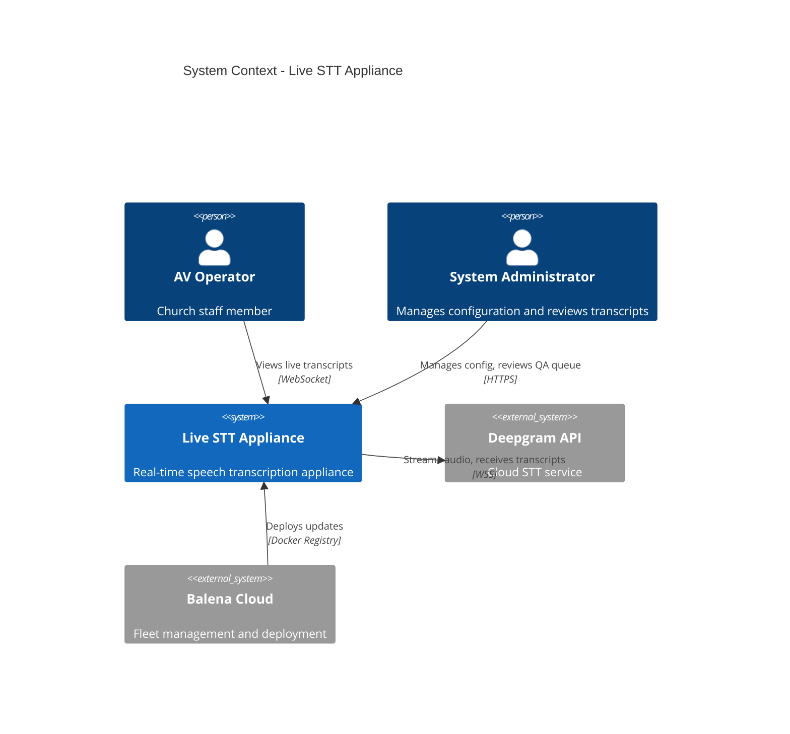
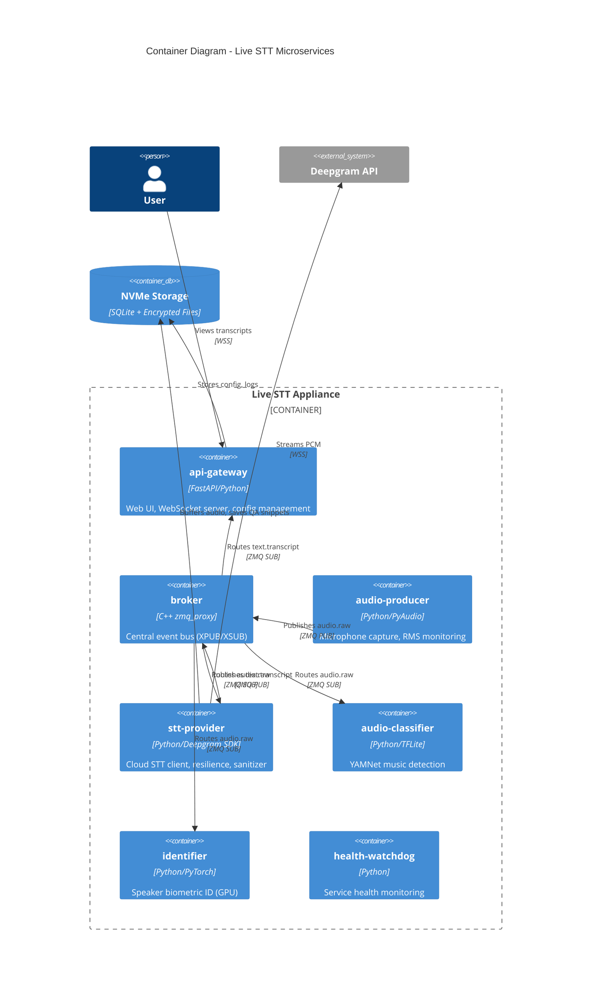
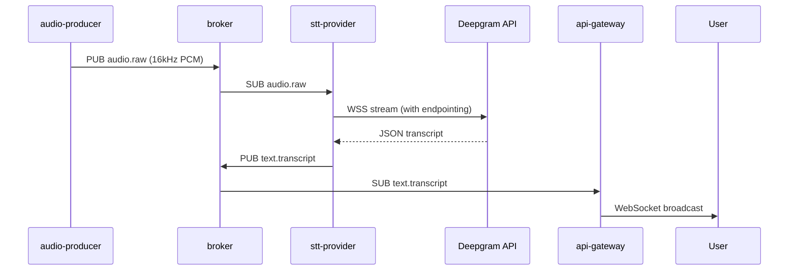

# Architecture Definition Document (ADD)

## 1. System Overview
The **Live STT** system is a high-reliability, real-time speech-to-text appliance designed for edge deployment on embedded hardware (Jetson Orin Nano). It implements an event-driven microservices architecture using ZeroMQ as the central message broker, enabling decoupled communication between audio processing, transcription, and UI services.

**Key Design Principles:**
- **Failure Domain Isolation**: UI (api-gateway) and transcription (stt-provider) run in separate containers
- **Zero Data Loss**: On-disk buffering during network outages
- **Multi-Tier Hardware Support**: Jetson (Tier 1), Desktop GPU (Tier 2), CPU-only (Tier 3)

## 2. System Context (C4 Level 1)


## 3. Container Diagram (C4 Level 2)


## 4. Component List

| Service | Technology | Purpose | Resilience Strategy |
|---------|-----------|---------|---------------------|
| **broker** | C++ ZMQ | Central event bus | Stateless, instant restart |
| **audio-producer** | Python/PyAudio | Mic capture | RMS monitoring, clipping detection |
| **stt-provider** | Python/Deepgram | Cloud STT client | On-disk buffering, catch-up on reconnect |
| **api-gateway** | FastAPI | Web UI, config | Decoupled from audio path, always responsive |
| **audio-classifier** | TFLite/YAMNet | Music detection | Pause STT during music |
| **identifier** | PyTorch/SpeechBrain | Speaker ID | GPU-accelerated, optional (M12+) |
| **health-watchdog** | Python | Service monitoring | Pings all services, exposes /status |

## 5. Deployment View

### Local Development (Tier 3)
```yaml
docker-compose.dev.yml:
  - Mock audio producer (reads .wav files)
  - All services except identifier (no GPU required)
  - Mounts: ./data, ./config
```

### Production (Tier 1 - Jetson)
```yaml
BalenaOS:
  - Fleet managed via Balena Cloud
  - TPM 2.0 for key sealing
  - Public device URL for remote access
  - Volume: /data (NVMe, encrypted)
```

### Hardware Tiers
- **Tier 1 (Jetson Orin Nano)**: Full stack including identifier (GPU), TPM sealing
- **Tier 2 (Desktop GPU)**: Docker Compose, user-provided encryption key
- **Tier 3 (CPU-only)**: Dev/testing, no identifier service

## 6. Data Flow



## 7. Key Architectural Decisions

See [ADRs](adrs/) for detailed rationale:
- [ADR-0001](adrs/0001-zmq-broker.md): ZMQ XPUB/XSUB broker pattern
- [ADR-0002](adrs/0002-decoupled-ui.md): Splitting stt-provider from api-gateway (v6.0)
- [ADR-0003](adrs/0003-multi-tier-hardware.md): Multi-tier hardware strategy
- [ADR-0004](adrs/0004-deepgram-selection.md): Deepgram as STT provider
- [ADR-0005](adrs/0005-balenaos-deployment.md): BalenaOS for fleet management

## 8. Quality Attributes

| Attribute | Target | Implementation |
|-----------|--------|----------------|
| **Latency** | \< 500ms (mic → UI) | Direct ZMQ routing, local broker |
| **Availability** | 99.9% uptime | Decoupled services, health monitoring |
| **Resilience** | Zero data loss | On-disk buffering during outages |
| **Security** | PII encrypted at rest | AES-256 per-file, TPM key sealing |
| **Scalability** | Single-device | Optimized for edge, not distributed |

## 9. Technology Stack

- **Broker**: ZeroMQ (C++)
- **Services**: Python 3.13, FastAPI, PyAudio, Deepgram SDK
- **ML**: TensorFlow Lite (YAMNet), PyTorch (SpeechBrain)
- **Database**: SQLite
- **Deployment**: Docker Compose, BalenaOS
- **Hardware**: NVIDIA Jetson Orin Nano (Tier 1)

---

**See Also:**
- [System Design](../system_design.md) - Detailed technical specification
- [HSI](hsi.md) - Hardware/Software interface details
- [Threat Model](threat_model.md) - Security architecture
