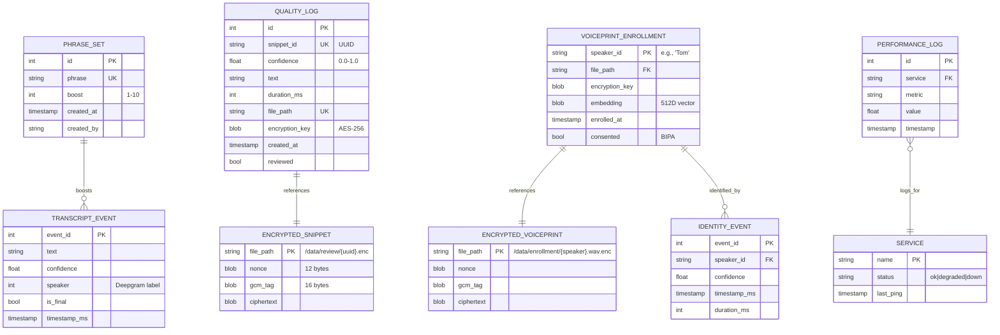
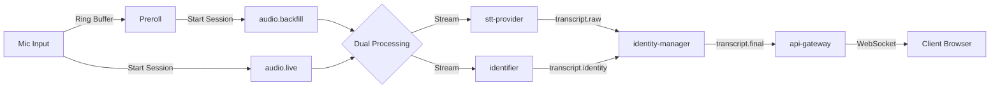

# Entity-Relationship Diagram (ERD v8.0)

## Overview
This document visualizes the data model for the Live STT system, showing relationships between configuration, quality assurance, and biometric enrollment data.

---

## ERD



---

## Key Relationships

### 1. `PHRASE_SET` → `TRANSCRIPT_EVENT`
- **Type**: One-to-Many (indirect)
- **Description**: Custom phrases in `phrase_set` are passed to Deepgram API, boosting their likelihood in transcripts
- **Enforcement**: Application logic in `stt-provider` (no foreign key)

### 2. `QUALITY_LOG` → `ENCRYPTED_SNIPPET`
- **Type**: One-to-One
- **Description**: Each low-confidence snippet has metadata in `quality_log` and encrypted audio in filesystem
- **Key**: `quality_log.file_path` references physical file path
- **Orphan Prevention**: Admin deletes snippet → `quality_log` row deleted → file deleted → encryption key crypto-shredded
- **Lookup**: API uses `snippet_id` (UUID) for external references (e.g., `/admin/snippet/{snippet_id}`)

### 3. `VOICEPRINT_ENROLLMENT` → `ENCRYPTED_VOICEPRINT`
- **Type**: One-to-One
- **Description**: Each enrolled speaker has metadata in `voiceprint_enrollment` and encrypted voiceprint in filesystem
- **Key**: `voiceprint_enrollment.file_path` references physical file path
- **Crypto-shredding**: Delete `voiceprint_enrollment.encryption_key` → file becomes permanently unrecoverable

### 4. `VOICEPRINT_ENROLLMENT` → `IDENTITY_EVENT`
- **Type**: One-to-Many
- **Description**: Each voiceprint can match multiple identity events (every time speaker is detected)
- **Key**: `identity_event.speaker_id` references `voiceprint_enrollment.speaker_id`
- **Enforcement**: Foreign key constraint in SQLite

### 5. `PERFORMANCE_LOG` → `SERVICE`
- **Type**: Many-to-One
- **Description**: Each service has many performance metrics logged over time
- **Key**: `performance_log.service` references `service.name`
- **Retention**: Logs older than 30 days automatically deleted (for disk space)

---

## Data Lifecycle

### Transcript Event (Buffered Split-Brain)


### Voiceprint Enrollment
```mermaid
flowchart LR
    A[Admin uploads WAV] -->|POST /admin/enrollment| B[api-gateway]
    B -->|Encrypt with file key| C[/data/enrollment/*.enc]
    B -->|Store metadata| D[voiceprint_enrollment table]
    D -->|Embedding extracted| E[identifier service]
    E -->|Publishes transcript.identity| F[broker]
```

### Crypto-Shredding (GDPR Right to Erasure)
```mermaid
flowchart LR
    A[Admin clicks Delete] -->|DELETE /admin/voiceprint/{id}| B[api-gateway]
    B -->|DELETE encryption_key| C[voiceprint_enrollment table]
    C -->|File still exists but...| D[Encrypted voiceprint]
    D -.->|Cannot decrypt without key| E[Data irretrievable]
```

---

## Indexing Strategy

| Table | Index | Columns | Purpose |
|-------|-------|---------|---------|
| `phrase_set` | `idx_phrase` | `phrase` | Fast lookup for autocomplete in admin UI |
| `quality_log` | `idx_confidence` | `confidence` | Filter snippets by confidence range |
| `quality_log` | `idx_created_at` | `created_at DESC` | Sort snippets chronologically |
| `performance_log` | `idx_service_timestamp` | `(service, timestamp)` | Time-series queries for dashboards |
| `voiceprint_enrollment` | Primary Key | `speaker_id` | Enforce unique speaker names |

---

## Data Retention Policy

| Data Type | Retention Period | Rationale |
|-----------|------------------|-----------|
| **Transcripts (in-memory)** | Session only | Not persisted (privacy by design) |
| **Low-confidence snippets** | Until admin review | Deleted after correction or approval |
| **Voiceprints** | Until speaker requests deletion | BIPA compliance (consent-based) |
| **Performance logs** | 30 days | Disk space constraints on Jetson |
| **Phrase set** | Indefinite | Static configuration data |

---

**See Also:**
- [Data Dictionary](data_dictionary.md) - Schema details
- [Biometric Policy](biometric_policy.md) - Voiceprint handling procedures
- [Threat Model](../20_architecture/threat_model.md) - Crypto-shredding implementation
