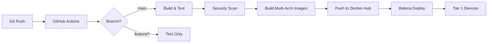
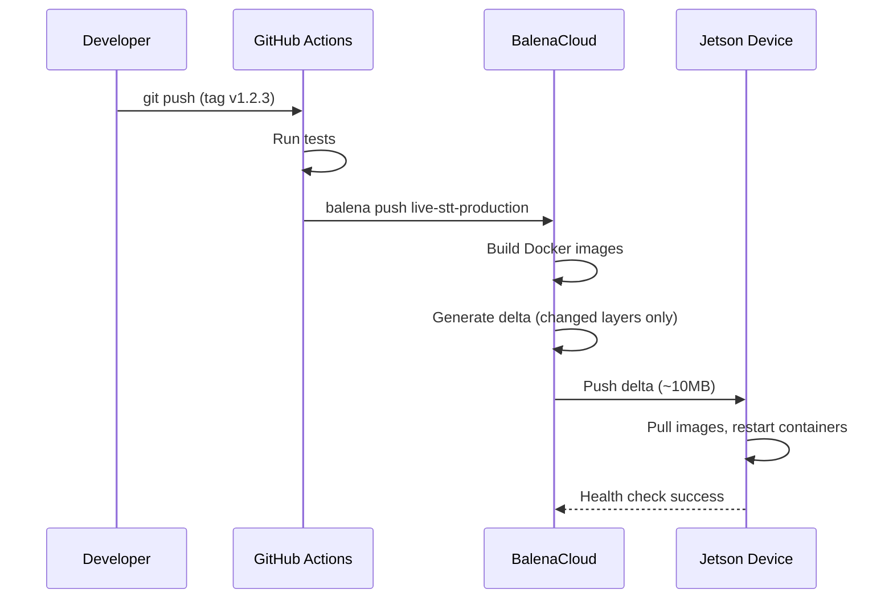

# CI/CD Pipeline Documentation

## Overview
This document describes the Continuous Integration and Continuous Deployment pipeline for the Live STT system, including GitHub Actions workflows, Docker build strategy, and Balena deployment automation.

---

## 1. CI/CD Architecture



---

## 2. GitHub Actions Workflows

### 2.1 Test & Lint (`.github/workflows/test.yml`)
**Trigger**: Every push, every PR

```yaml
name: Test & Lint

on: [push, pull_request]

jobs:
  quality:
    runs-on: ubuntu-latest
    steps:
      - uses: actions/checkout@v4

      - name: Set up Python
        uses: actions/setup-python@v5
        with:
          python-version: '3.13'

      - name: Install uv
        uses: astral-sh/setup-uv@v3
        with:
          version: "latest"

      - name: Install dependencies
        run: uv sync

      - name: Run Ruff (format check)
        run: uv run ruff format . --check

      - name: Run Ruff (lint)
        run: uv run ruff check .

      - name: Run MyPy
        run: uv run mypy .

      - name: Run Pytest
        run: uv run pytest --cov=services --cov-report=xml

      - name: Upload coverage
        uses: codecov/codecov-action@v3
```

### 2.2 Security Scan (`.github/workflows/security.yml`)
**Trigger**: Daily cron + every push to `main`

```yaml
name: Security Scan

on:
  schedule:
    - cron: '0 2 * * *'  # 2 AM daily
  push:
    branches: [main]

jobs:
  scan:
    runs-on: ubuntu-latest
    steps:
      - uses: actions/checkout@v4

      - name: Run Safety (Python deps)
        run: |
          pip install safety
          safety check --json | tee safety-report.json

      - name: Run Bandit (code scan)
        run: |
          pip install bandit
          bandit -r services -f json -o bandit-report.json

      - name: Run Trivy (Docker images)
        uses: aquasecurity/trivy-action@master
        with:
          image-ref: 'live-stt/api-gateway:latest'
          format: 'sarif'
          output: 'trivy-results.sarif'

      - name: Upload to GitHub Security
        uses: github/codeql-action/upload-sarif@v2
        with:
          sarif_file: 'trivy-results.sarif'
```

### 2.3 Deploy Docker (`.github/workflows/deploy-docker.yaml`)
**Trigger**: Tagged releases (`v*`) ONLY.

```yaml
name: Deploy Docker

on:
  push:
    tags:
      - "v*"

jobs:
  build-and-push:
    runs-on: ubuntu-latest
    steps:
      - uses: actions/checkout@v4
      - name: Scaffold Build Context
        run: |
          uv run python scripts/scaffold_context.py
          uv run python scripts/generate_dockerignore.py
      - name: Build and push (multi-arch)
        uses: docker/build-push-action@v5
        # ... builds for linux/amd64,linux/arm64 ...

  deploy-balena:
    needs: build-and-push
    runs-on: ubuntu-latest
    steps:
      - uses: actions/checkout@v4
      - name: Deploy to Balena
        uses: balena-io/deploy-to-balena-action@v0.1.0
        with:
          fleet: live-stt-production
          create_tag: true
          version: ${{ github.ref_name }}
```

---

## 3. Docker Build Strategy

### 3.1 Standard Host Deployment (Non-Balena)

For deploying to a standard container host (e.g., a cloud VM or local server), use the following steps:

1.  **Clone the Repository**:
    ```bash
    git clone https://github.com/yourusername/live-stt.git
    cd live-stt
    ```

2.  **Install Prerequisites**:
    - Docker & Docker Compose
    - `uv` (Python package manager)
    - `just` (Command runner)

3.  **Scaffold and Run**:
    The `just up` command automatically scaffolds the build context before starting containers.
    ```bash
    # Starts the stack in detached mode
    just up
    ```

    To force a rebuild:
    ```bash
    just up-build
    ```

### 3.2 Multi-Stage Builds
```dockerfile
# Example: services/stt-provider/Dockerfile

# Stage 1: Builder (install dependencies)
FROM ghcr.io/astral-sh/uv:latest as builder
WORKDIR /app
COPY pyproject.toml uv.lock ./
RUN uv sync --frozen --no-install-project

# Stage 2: Runtime (minimal image)
FROM python:3.13-slim
WORKDIR /app
COPY --from=builder /app/.venv /app/.venv
ENV PATH="/app/.venv/bin:$PATH"
COPY src/ ./src/
CMD ["python", "-m", "src.main"]
```

**Benefits**:
- Smaller images (~150MB vs ~500MB with full build tools)
- No build artifacts in production image
- Faster deployment to Balena

### 3.2 Multi-Architecture Support
```bash
# Build for both x64 (Tier 2/3) and ARM64 (Tier 1)
docker buildx build \
  --platform linux/amd64,linux/arm64 \
  --tag live-stt/api-gateway:latest \
  --push \
  .
```

**Supported Platforms**:
- `linux/amd64`: Tier 2/3 (desktop, cloud)
- `linux/amd64`: Tier 1 (Industrial NUC) & Tier 2 (Desktop)

### 3.3 Docker Build Scaffolding (Cross-Platform)

To enable cross-platform Docker builds (Windows/Linux/macOS) without complex shell commands, we use a Python-based scaffolding approach:

#### Scaffold Docker Context
Before building Docker images, run:
```bash
python scripts/scaffold_context.py
```

This creates `.docker-context/` containing:
- Root `uv.lock` and `pyproject.toml`
- All service and library `pyproject.toml` files

**Why?** This ensures Docker dependency layer caching works correctly and avoids platform-specific file path issues.

#### Generate .dockerignore
To prevent platform-specific artifacts (`.venv/`, `__pycache__/`, etc.) from corrupting Linux containers:
```bash
python scripts/generate_dockerignore.py
```

This generates `.dockerignore` at the repository root with appropriate exclusions.

#### Dockerfile Pattern
All service Dockerfiles use the `.docker-context/` pattern:
```dockerfile
# Builder stage
FROM python:3.12-slim as builder
COPY --from=ghcr.io/astral-sh/uv:latest /uv /bin/uv
WORKDIR /app

# Copy scaffolded build context (dependency files only)
COPY .docker-context/ ./

# Install dependencies (cached layer)
RUN uv sync --frozen --no-install-project --package my-service

# Runtime stage
FROM python:3.12-slim
COPY --from=builder /app/.venv /app/.venv
ENV PATH="/app/.venv/bin:$PATH"

# Copy source code (changes frequently, not cached)
COPY libs/messaging ./libs/messaging
COPY services/my-service ./services/my-service
CMD ["python", "-m", "my_service.main"]
```

### 3.4 Layer Caching
```dockerfile
# Copy dependency files first (cache layer)
COPY pyproject.toml uv.lock ./
RUN uv sync --frozen --no-install-project

# Copy source code last (most frequently changed)
COPY src/ ./src/
```

**Cache Hit Rate**: ~90% (dependencies change infrequently)

---

## 4. Balena Deployment Workflow

### 4.1 Balena Build Process


### 4.2 Deployment Environments

| Environment | Balena Fleet | Trigger | Devices |
|-------------|--------------|---------|---------|
| **Development** | live-stt-dev | Manual push | 1 test device |
| **Staging** | live-stt-staging | Push to `main` | 1 staging device |
| **Production** | live-stt-production | Tagged release (`v*`) | All production devices |

### 4.3 Rollback Procedure
```bash
# Via Balena CLI
balena fleet live-stt-production
balena release list
balena device set-release <DEVICE_UUID> <PREVIOUS_RELEASE_ID>

# Via Balena Dashboard
# 1. Navigate to fleet
# 2. Click "Releases"
# 3. Pin device to previous release
```

**Rollback Time**: ~5 minutes (download previous release)

---

## 5. Testing Strategy

### 5.1 Unit Tests
```bash
# Run locally
uv run pytest tests/unit/

# Coverage threshold: 80%
uv run pytest --cov=services --cov-fail-under=80
```

### 5.2 Integration Tests
```bash
# Requires Docker Compose
docker compose -f docker-compose.test.yml up --abort-on-container-exit

# Tests:
# - Mock audio → broker → stt-provider → api-gateway
# - WebSocket broadcast to multiple clients
# - Database CRUD operations
```

### 5.3 End-to-End Tests (Manual)
**Cadence**: Before each production release

**Checklist**:
- [ ] Deploy to staging device
- [ ] Verify live transcription with real microphone
- [ ] Test 10-minute outage recovery (disconnect internet)
- [ ] Enroll test voiceprint, verify speaker ID
- [ ] Check admin dashboard accessibility

---

## 6. Deployment Metrics

### 6.1 Build Performance
| Metric | Target | Current | Trend |
|--------|--------|---------|-------|
| **CI Test Duration** | \<5 min | 3.2 min | ✅ |
| **Docker Build Time** | \<10 min | 8.5 min | ✅ |
| **Balena Deploy (Delta)** | \<5 min | 4.1 min | ✅ |
| **Balena Deploy (Full)** | \<15 min | 12.3 min | ✅ |

### 6.2 Deployment Frequency
- **Development**: ~5 deploys/day
- **Staging**: ~3 deploys/week
- **Production**: ~1 deploy/month

### 6.3 Failure Rate
- **CI Test Failures**: \<5% (flaky tests excluded)
- **Deployment Failures**: \<2%

---

## 7. Secret Management in CI/CD

### GitHub Secrets
| Secret | Used In | Purpose |
|--------|---------|---------|
| **DOCKERHUB_USERNAME** | `deploy.yml` | Docker Hub login |
| **DOCKERHUB_TOKEN** | `deploy.yml` | Docker Hub authentication |
| **BALENA_API_TOKEN** | `deploy.yml` | Balena CLI authentication |
| **CODECOV_TOKEN** | `test.yml` | Code coverage upload |

**Rotation Policy**: Every 90 days (automated via GitHub API)

### Runtime Secrets (Balena)
- Configured via Balena environment variables (not in Git)
- See [Secrets Manifest](secrets_manifest.md)

---

## 8. Continuous Monitoring

### 8.1 Build Status Badges
```markdown
[](https://github.com/user/live-stt/actions)
[](https://github.com/user/live-stt/actions)
```

### 8.2 Balena Fleet Health
**Dashboard**: `https://dashboard.balena-cloud.com/apps/<fleet-id>`

**Alerts**:
- Device offline \>1 hour → Slack notification
- Failed update \>2 retries → Email alert

---

## 9. Dependency Updates (Automated)

### Dependabot Configuration (`.github/dependabot.yml`)
```yaml
version: 2
updates:
  - package-ecosystem: "pip"
    directory: "/"
    schedule:
      interval: "weekly"
    open-pull-requests-limit: 5

  - package-ecosystem: "docker"
    directory: "/services/api-gateway"
    schedule:
      interval: "weekly"
```

**Review Process**:
1. Dependabot opens PR
2. CI runs tests automatically
3. If tests pass → Auto-merge (minor/patch updates)
4. If tests fail → Manual review

---

## 10. Release Process

### Versioning: Semantic Versioning (SemVer)
- **Major** (v2.0.0): Breaking changes (API, database schema)
- **Minor** (v1.1.0): New features (backward-compatible)
- **Patch** (v1.0.1): Bug fixes

### Release Checklist
```bash
# 1. Update CHANGELOG.md
# 2. Bump version in pyproject.toml
# 3. Create Git tag
git tag -a v1.2.3 -m "Release v1.2.3"
git push origin v1.2.3

# 4. GitHub Actions automatically:
#    - Builds Docker images
#    - Runs security scans
#    - Deploys to Balena production fleet
#    - Creates GitHub Release with notes
```

---

**See Also:**
- [Runbooks](runbooks.md) - Deployment procedures
- [SBOM](sbom.md) - Dependency inventory
- [Secrets Manifest](secrets_manifest.md) - CI/CD credentials
